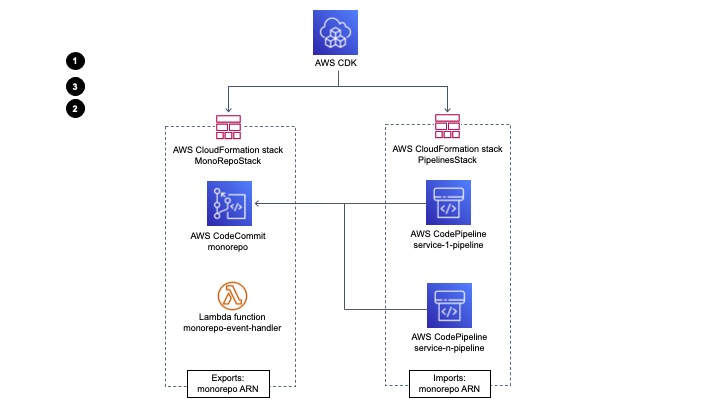

# CodeCommit monorepo multi pipeline triggers

This solution allows a mono-repository, which is composed of multiple services, have different CI/CD pipelines for each service. The solution detects which top level directory the modification happened and triggers the AWS CodePipeline configured to that directory.

 

## Project structure

This repository contains a AWS CDK project with two stacks: `MonoRepoStack` and `PipelinesStack`. <br/>
`MonoRepoStack` is responsible for creating the AWS CodeCommit monorepo and the AWS Lambda with the logic to trigger the different pipelines. It is core part of the solution and doesn't need to be modified by the stack's user. <br/>
`PipelinesStack` is the stack where the users will define their pipeline infrastructure. This repository comes with a demo and hotsite pipelines that deploys two static websites using S3 and CloudFront. <br/>

 

### Directories and files

#### *core*:
It contains the CDK Stack that creates the CodeCommit monorepo, AWS Lambda and all the logic needed to start a specific AWS CodePipeline according to a modified file path inside the monorepo. This directory is designed to not be modified. CodeCommit will be created with a sample project structure defined in `monorepo-sample` directory.

#### *monorepo-sample*:
It contains a project structure that will be committed to CodeCommit after it is created. It comes with two simple static websites inside the directory.

#### *pipelines*: 
It contains the files with the definition of each service pipeline.
There is two examples inside this direcctory: `pipeline_demo.py` and `pipeline_hotsite.py`, wich demonstrates how a pipeline should be defined. It deploys the `demo` and `hotsite` websites inside the `monorepo-sample`.<br />

Stack's users will do their work inside of this directory, creating new python classes child of `ServicePipeline` class and implement the abstract methods: `pipeline_name()` and `build_pipeline()`.

#### *monorepo_config.py*:

This file contains the link between each microservice directory and its pipeline definition:

```python
service_map: Dict[str, ServicePipeline]  = {
    # folder-name -> pipeline-class
    'demo': DemoPipeline(),
    'hotsite': HotsitePipeline()
}
```

## Running the project

### Requirements

To use this solution, you need the following:
* [Python 3](https://www.python.org/downloads/)
* pip (package installer for Python), which already comes with Python 3 distribution: [https://pip.pypa.io/en/stable/](https://pip.pypa.io/en/stable/)
* [AWS CDK](https://docs.aws.amazon.com/cdk/latest/guide/getting_started.html)


### Workspace setup

1. clone this repository
2. create virtualenv and install dependencies:
    * `make install`
3. bootstraps the application:
    * `make bootstrap account-id=<your-account-id> region=us-<desired-region>`

### Deploy MonoRepoStack

Since this MonoRepoStack won't be modified, it should be deployed once. <br/>
This stack accepts the following parameter: 

|Parameter name|Default Value|Type|
|---|---|---|
|MonorepoName| monorepo-sample | String|

To deploy the stack with default parameter values, type the following command: <br/>
`make deploy-core`

To deploy the stack with custom parameters, type the following command: <br/>
`make deploy-core monorepo-name=<repo name>`

You can confirm whether the resources were correctly created by getting information about the monorepo codecommit repository: <br/>

`aws codecommit get-repository --repository-name <repo name>`

> This stack creates the AWS CodeCommit where your monorepo will be stored. Therefore, don't run `cdk destroy MonoRepoStack` after will have started pushing modification to this repo, otherwise you will loose your remote repository.

### Deploy PipelinesStack

This stack must be deployed after MonoRepoStack has already been deployed. It will grow according to new microservices added into the monorepo code base. <br/>
To deploy it, type the following command:

`make deploy-pipelines`

PipelinesStacks deployment prints the services URLs at the end of its execution:

```bash
Outputs:
PipelinesStack.demourl = <distribution id>.cloudfront.net
PipelinesStack.hotsiteurl = <distribution id>.cloudfront.net
```

You can check the Demo and Hotsite services working by accessing the above URLs.

### Deploy both stacks

If you want to deploy both stacks on the same time, you can execute the following command for executing the deploy:

`make deploy monorepo-name=<repo name>`

### Checkout monorepo

If you dont have a connection with the CodeCommit in your account yet, please follow the instructions of the offical documentation [here](https://docs.aws.amazon.com/codecommit/latest/userguide/how-to-connect.html).

## Steps for creating a new service pipeline

In order to create a new pipeline for a new service (my-service), you should follow the bellow steps:

1. Create a new python file inside the pipelines directory: `myservice_pipeline.py`
2. Create a class `MyServicePipeline` and declare `ServicePipeline` as its super class.
    ```python 
    class MyServicePipeline(ServicePipeline):
        def pipeline_name():
            return 'my-service-pipeline'

        def build_pipeline():
            # Define your CodePipeline here
    ```
3. In `monorepo_config.py`, import myservice_pipeline module:
    ```python
    from pipelines.myservice_pipeline import MyServicePipeline
    ```
4. Modify `service_map` variable inside the `monorepo_config.py` file and add the map folder -> Service Class:
    ```python
    {
        # ... other mappings
        'my-service': MyServicePipeline()
    }
    ```
5. Redeploy PipelinesStack:
    ```bash
    make deploy-pipelines
    ```
6. Inside your monorepo, edit the json file `monorepo-main.json` and add the new mapping:
    ```js
    {
        // ... other mappings
        "my-service": "my-service-pipeline"
    }
    ```
7. Inside your monorepo, include the source code for the new service under a folder named `my-service`.
8. Commit and push the modification made in steps 6 and 7.

## Cleanup

For deleting your stacks, execute the following command:

`make destroy`

After executing the command, on the Amazon S3 console, delete the buckets associated with the your pipelines starting with the following name: `pipelinesstack-codepipeline*`.

> To delete a bucket, first you have to empty it and then delete it.

## Security
See [CONTRIBUTING](CONTRIBUTING.md#security-issue-notifications) for more information.

## License

This library is licensed under the MIT-0 License. See the [LICENSE](LICENSE) file.

